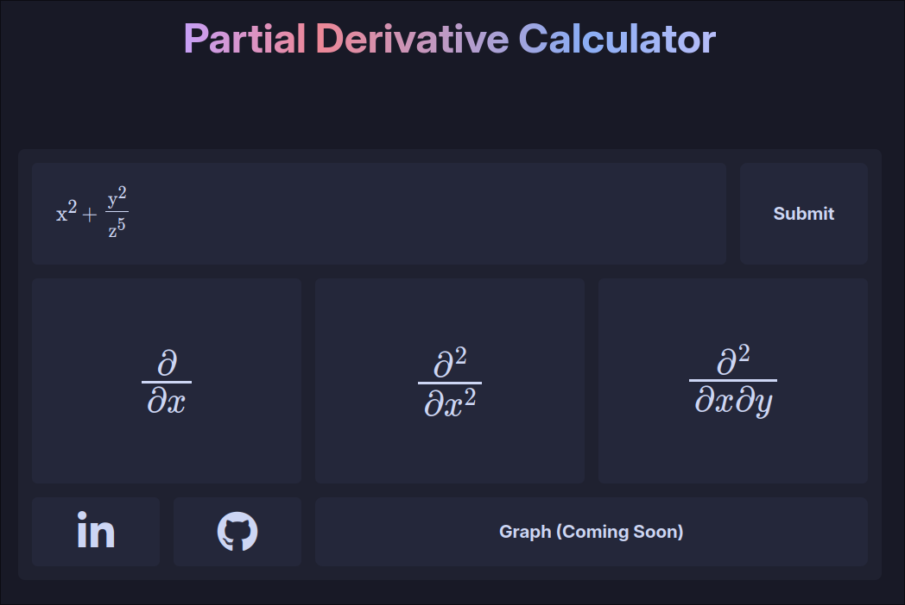

# Partial Derivative Calculator
___
<p align=center>

</p>
___

This project is a web-based application for calculating partial derivatives of mathematical functions. It leverages Flask for the backend, SymPy for symbolic mathematics, and MathQuill for rendering mathematical expressions.

## Features

- **Latex Parsing**: Converts LaTeX input into SymPy expressions.
- **Partial Derivatives**: Computes first and second partial derivatives.
- **Interactive UI**: Uses MathQuill for an interactive math input field.
- **Modal Popups**: Displays results in modal popups.

## Technologies Used

- **Flask**: A micro web framework for Python.
- **SymPy**: A Python library for symbolic mathematics.
- **MathQuill**: A web formula editor for LaTeX.
- **jQuery**: A fast, small, and feature-rich JavaScript library.
- **Font Awesome**: For icons.
- **CSS**: For styling the application.

## File Structure

- `index.html`: The main HTML file.
- `mathjax.js`: Handles MathJax configuration.
- `scripts.js`: Contains JavaScript for form submission and MathQuill integration.
- `popup.js`: Manages modal popups.
- `popup.css`: Styles for modal popups.
- `mathquill.js`: MathQuill library.
- `mathquill.css`: Styles for MathQuill.
- `app.py`: The Flask application.
- `styles.css`: General styles for the application.

## Setup

1. **Clone the repository**:
    ```sh
    git clone https://github.com/yourusername/PartialDerivativeCalc.git
    cd PartialDerivativeCalc
    ```

2. **Create a virtual environment**:
    ```sh
    python3 -m venv venv
    source venv/bin/activate
    ```

3. **Install dependencies**:
    ```sh
    pip install -r requirements.txt
    ```

4. **Run the application**:
    ```sh
    python app.py
    ```

5. **Open your browser** and navigate to `http://127.0.0.1:5000`.

## Usage

1. **Enter a function** in LaTeX format in the input field.
2. **Submit the form** to calculate the partial derivatives.
3. **View the results** in the modal popup.

## License

This project is licensed under the Apache License 2.0. See the [LICENSE](LICENSE) file for details.

## Acknowledgements

- [MathJax](https://www.mathjax.org/)
- [MathQuill](http://mathquill.com/)
- [SymPy](https://www.sympy.org/en/index.html)
- [Flask](https://flask.palletsprojects.com/)

Feel free to contribute to this project by submitting issues or pull requests.
